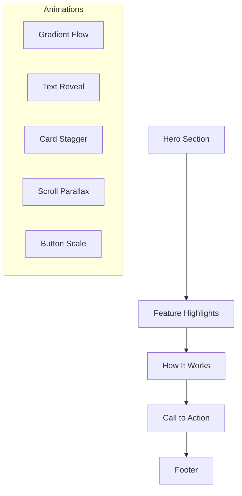

# Argus A.I Frontend Redesign Plan
## Achieving Eloquent.com-Style Premium Aesthetic

### Executive Summary
This document outlines the complete frontend redesign of the Argus A.I Flask application to achieve a premium, animated user interface similar to eloquent.com. The redesign will incorporate smooth scrolling, parallax effects, reveal animations, custom cursor, and modern typography while maintaining all existing functionality.

---

## 1. Technology Stack

### 1.1 Build System
- **Vite** - Lightning-fast build tool with hot module replacement
  - Replaces raw Flask static file serving
  - Provides optimized production builds
  - Enables modern ES modules

### 1.2 Framework & Architecture
- **React.js** - Component-based UI library
  - Better state management for interactive elements
  - Rich animation ecosystem
  - Can coexist with Flask backend via API integration
  
**Alternative (Keep Flask):**
- **HTMX** - Dynamic HTML without JavaScript framework
  - Lightweight approach
  - Server-side rendering maintained
  - Progressive enhancement
  
**Recommendation:** Use React for frontend with Flask providing API endpoints

### 1.3 Styling
- **Tailwind CSS** - Utility-first CSS framework
  - Rapid development
  - Built-in design system
  - Easy customization
  
- **Custom CSS Modules** - For complex animations and effects

### 1.4 Animation Libraries
- **GSAP (GreenSock Animation Platform)**
  - Industry-standard for complex animations
  - Timeline-based animations
  - ScrollTrigger for scroll-based effects
  - Performance optimized
  
- **Lenis** - Smooth scrolling library
  - Native-like smooth scroll
  - Scroll momentum
  - Works with GSAP ScrollTrigger
  
- **Framer Motion** - React animation library
  - Declarative animations
  - Gestures support
  - Layout animations

### 1.5 Typography
- **Google Fonts** - Free, high-quality fonts
  - Primary: Inter or Plus Jakarta Sans
  - Display: Playfair Display or DM Serif Display
  - Script accent: Kunstler Script (existing)

### 1.6 3D Graphics (Premium Enhancement)
- **Three.js** - WebGL 3D graphics library
  - Interactive 3D backgrounds
  - Animated geometric shapes
  - Particle systems
  - 3D data visualizations
  
- **React Three Fiber** - Three.js renderer for React
  - Declarative 3D scenes
  - Easy component integration
  - Hooks for 3D interactions
  
- **React Three Drei** - Useful helpers for R3F
  - Camera controls
  - Environment maps
  - Performance optimization

#### 3D Scene Ideas for Argus A.I
```jsx
// Example: Floating geometric particles background
import { Canvas } from '@react-three/fiber'
import { Particles } from './components/3d/Particles'

export const Hero3D = () => {
  return (
    <Canvas camera={{ position: [0, 0, 5] }}>
      <ambientLight intensity={0.5} />
      <pointLight position={[10, 10, 10]} />
      <Particles count={100} />
    </Canvas>
  )
}
```

---

## 2. Visual Effects Implementation

### 2.1 Smooth Scrolling
```javascript
// Initialize Lenis smooth scroll
import Lenis from '@studio-freight/lenis'

const lenis = new Lenis({
  duration: 1.2,
  easing: (t) => Math.min(1, 1.001 - Math.pow(2, -10 * t)),
  orientation: 'vertical',
  smoothWheel: true
})

function raf(time) {
  lenis.raf(time)
  requestAnimationFrame(raf)
}

requestAnimationFrame(raf)
```

### 2.2 Parallax Effects
```javascript
// Parallax component using GSAP
import { useGSAP } from '@gsap/react'
import gsap from 'gsap'
import { ScrollTrigger } from 'gsap/ScrollTrigger'

gsap.registerPlugin(ScrollTrigger)

useGSAP(() => {
  gsap.to('.parallax-element', {
    yPercent: -50,
    ease: 'none',
    scrollTrigger: {
      trigger: '.parallax-container',
      start: 'top bottom',
      end: 'bottom top',
      scrub: true
    }
  })
})
```

### 2.3 Reveal Animations
```javascript
// Intersection Observer + CSS Classes
const observerOptions = {
  threshold: 0.1,
  rootMargin: '0px 0px -50px 0px'
}

const observer = new IntersectionObserver((entries) => {
  entries.forEach(entry => {
    if (entry.isIntersecting) {
      entry.target.classList.add('reveal-visible')
    }
  })
}, observerOptions)
```

### 2.4 Custom Cursor
```javascript
// Custom cursor with trailing effect
const cursor = document.querySelector('.custom-cursor')
const cursorFollower = document.querySelector('.cursor-follower')

document.addEventListener('mousemove', (e) => {
  cursor.style.left = e.clientX + 'px'
  cursor.style.top = e.clientY + 'px'
  
  // Delayed follower
  setTimeout(() => {
    cursorFollower.style.left = e.clientX + 'px'
    cursorFollower.style.top = e.clientY + 'px'
  }, 100)
})
```

---

## 3. Page-by-Page Redesign

### 3.1 Welcome/Landing Page
**Current:** Basic layout with title and navigation
**New Design:**
- Full-screen hero section with animated gradient background
- Typing effect for "Argus A.I" logo
- Floating particles or geometric shapes
- Staggered entrance animations for navigation buttons
- Scroll indicator with animated arrow



### 3.2 Home Page
**Current:** Basic navigation and content area
**New Design:**
- Modern card-based layout for features
- Interactive hover effects on cards
- Background with subtle animation
- Animated statistics or metrics display
- Smooth section transitions

### 3.3 Upload Page
**Current:** Basic upload form
**New Design:**
- Drag-and-drop zone with hover animations
- File preview with smooth transitions
- Progress bar with animated fill
- Loading states with skeleton screens
- Success animation on upload complete

### 3.4 FAQ Page
**Current:** Basic FAQ list
**New Design:**
- Accordion-style questions with smooth expand/collapse
- Plus/minus icon rotation animation
- Smooth height transitions
- Active state highlighting
- Staggered entrance for all items

### 3.5 Educate Page
**Current:** Educational content display
**New Design:**
- Interactive learning modules
- Progress indicators with animations
- Smooth step transitions
- Interactive diagrams or examples
- Engaging visual hierarchy

---

## 4. Design System

### 4.1 Color Palette
```css
:root {
  /* Primary Colors */
  --color-primary: #6366f1;
  --color-primary-light: #818cf8;
  --color-primary-dark: #4f46e5;
  
  /* Background Colors */
  --bg-dark: #0c0f1a;
  --bg-darker: #05070d;
  --bg-gradient: radial-gradient(circle at top, #0c0f1a, #05070d);
  
  /* Accent Colors */
  --color-accent: #22d3ee;
  --color-accent-glow: rgba(34, 211, 238, 0.3);
  
  /* Glass Effect */
  --glass-bg: rgba(255, 255, 255, 0.05);
  --glass-border: rgba(255, 255, 255, 0.1);
  --glass-blur: 20px;
  
  /* Typography Colors */
  --text-primary: #ffffff;
  --text-secondary: rgba(255, 255, 255, 0.7);
  --text-muted: rgba(255, 255, 255, 0.5);
}
```

### 4.2 Typography Scale
```css
:root {
  --font-display: 'Playfair Display', serif;
  --font-primary: 'Inter', sans-serif;
  --font-accent: 'Kunstler Script', cursive;
  
  --text-xs: 0.75rem;
  --text-sm: 0.875rem;
  --text-base: 1rem;
  --text-lg: 1.125rem;
  --text-xl: 1.25rem;
  --text-2xl: 1.5rem;
  --text-3xl: 1.875rem;
  --text-4xl: 2.25rem;
  --text-5xl: 3rem;
  --text-6xl: 3.75rem;
}
```

### 4.3 Spacing System
```css
:root {
  --space-1: 0.25rem;
  --space-2: 0.5rem;
  --space-3: 0.75rem;
  --space-4: 1rem;
  --space-5: 1.25rem;
  --space-6: 1.5rem;
  --space-8: 2rem;
  --space-10: 2.5rem;
  --space-12: 3rem;
  --space-16: 4rem;
  --space-20: 5rem;
  --space-24: 6rem;
}
```

### 4.4 Animation Durations
```css
:root {
  --duration-fast: 150ms;
  --duration-normal: 300ms;
  --duration-slow: 500ms;
  --duration-slower: 750ms;
  --duration-long: 1000ms;
  
  --ease-out: cubic-bezier(0.4, 0, 0.2, 1);
  --ease-out-back: cubic-bezier(0.34, 1.56, 0.64, 1);
  --ease-in-out: cubic-bezier(0.4, 0, 0.2, 1);
}
```

---

## 5. Component Architecture

### 5.1 Core Components
```
src/
├── components/
│   ├── ui/
│   │   ├── Button/
│   │   │   ├── Button.jsx
│   │   │   ├── Button.css
│   │   │   └── index.js
│   │   ├── Card/
│   │   ├── Modal/
│   │   ├── Input/
│   │   └── Cursor/
│   ├── layout/
│   │   ├── Header/
│   │   ├── Footer/
│   │   ├── Section/
│   │   └── Container/
│   ├── animations/
│   │   ├── Reveal/
│   │   ├── Parallax/
│   │   ├── Stagger/
│   │   └── ScrollProgress/
│   └── **3d/**
│       ├── Canvas/
│       │   ├── Canvas.jsx
│       │   └── index.js
│       ├── Particles/
│       │   ├── Particles.jsx
│       │   └── index.js
│       ├── GeometricShapes/
│       │   ├── GeometricShapes.jsx
│       │   └── index.js
│       └── InteractiveModel/
│           ├── InteractiveModel.jsx
│           └── index.js
├── pages/
│   ├── Home/
│   ├── Upload/
│   ├── FAQ/
│   └── Educate/
├── hooks/
│   ├── useScroll.js
│   ├── useIntersection.js
│   └── useMousePosition.js
├── styles/
│   ├── globals.css
│   ├── variables.css
│   └── animations.css
└── utils/
    └── animation.js
```

### 5.2 Component Examples

**Button Component:**
```jsx
import { motion } from 'framer-motion'

export const Button = ({ children, variant = 'primary', ...props }) => {
  return (
    <motion.button
      className={`btn btn-${variant}`}
      whileHover={{ scale: 1.05 }}
      whileTap={{ scale: 0.95 }}
      {...props}
    >
      {children}
    </motion.button>
  )
}
```

**Reveal Component:**
```jsx
import { motion } from 'framer-motion'

export const Reveal = ({ children, delay = 0 }) => {
  return (
    <motion.div
      initial={{ opacity: 0, y: 30 }}
      whileInView={{ opacity: 1, y: 0 }}
      viewport={{ once: true }}
      transition={{ duration: 0.6, delay, ease: 'easeOut' }}
    >
      {children}
    </motion.div>
  )
}
```

---

## 6. Implementation Roadmap

### Phase 1: Foundation
1. Set up React project with Vite
2. Configure Tailwind CSS with custom design system
3. Install and configure GSAP, Lenis, Framer Motion
4. Create base layout component with smooth scroll

### Phase 2: Core Components
5. Build reusable UI components (Button, Card, Modal)
6. Create animation components (Reveal, Parallax, Stagger)
7. Implement custom cursor system
8. Design typography system

### Phase 3: Page Development
9. Redesign Home page with hero section
10. Rebuild Upload page with interactive elements
11. Create FAQ page with accordion animations
12. Build Educate page with interactive modules

### Phase 4: Polish & Optimize
13. Add page transition effects
14. Optimize animations for 60fps
15. Ensure mobile responsiveness
16. Test cross-browser compatibility
17. Verify accessibility compliance

---

## 7. Performance Considerations

### 7.1 Animation Performance
- Use `transform` and `opacity` for animations (GPU accelerated)
- Avoid animating expensive properties (width, height, top, left)
- Use `will-change` sparingly
- Implement lazy loading for heavy animations
- Use requestAnimationFrame for smooth updates

### 7.2 Bundle Optimization
- Code splitting with Vite
- Lazy load pages
- Tree shaking unused CSS
- Optimize images with WebP format
- Implement skeleton screens for loading states

---

## 8. Accessibility (WCAG Compliance)

### 8.1 Motion Sensitivity
```css
@media (prefers-reduced-motion: reduce) {
  * {
    animation-duration: 0.01ms !important;
    animation-iteration-count: 1 !important;
    transition-duration: 0.01ms !important;
    scroll-behavior: auto !important;
  }
}
```

### 8.2 Keyboard Navigation
- Ensure custom cursor doesn't interfere with keyboard navigation
- Maintain visible focus states
- Support skip links
- Test with screen readers

---

## 9. Browser Support

- Chrome 90+
- Firefox 88+
- Safari 14+
- Edge 90+
- Mobile browsers (iOS Safari 14+, Chrome Mobile 90+)

---

## 10. File Structure Changes

```
webapp/
├── src/                    # New React source files
│   ├── components/        # React components
│   ├── pages/            # Page components
│   ├── hooks/            # Custom hooks
│   ├── styles/           # Global styles
│   ├── utils/            # Utility functions
│   ├── App.jsx           # Main app component
│   └── main.jsx          # Entry point
├── public/                # Static assets
├── index.html            # HTML entry
├── vite.config.js        # Vite configuration
├── tailwind.config.js    # Tailwind configuration
└── package.json          # Dependencies
```

---

## 11. Next Steps

1. **Approve this plan** - Confirm technology choices and scope
2. **Set up development environment** - Install Node.js, create Vite project
3. **Create base components** - Build foundation components
4. **Implement page by page** - Develop each page with animations
5. **Test and iterate** - User testing and refinement
6. **Deploy** - Production deployment

---

**Plan Created:** 2026-02-09
**Estimated Duration:** 4-6 weeks (full implementation)
**Risk Level:** Medium - Complex animations require careful optimization
